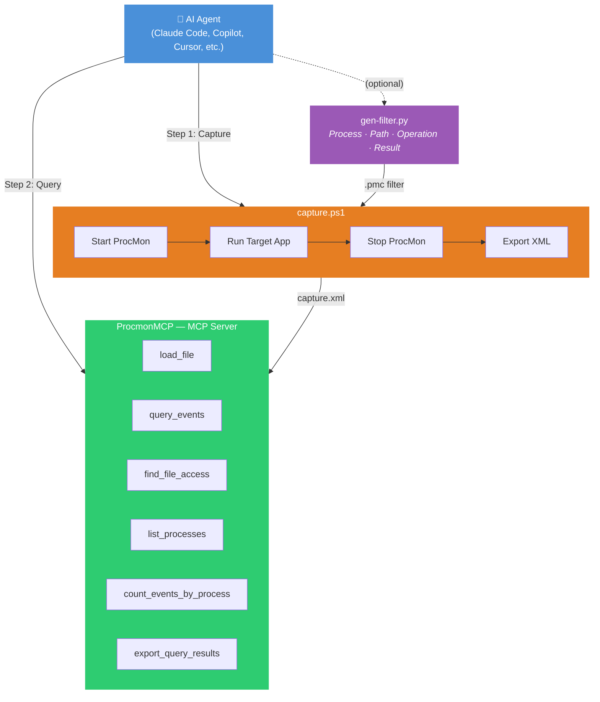

<div align="center">

# ProcMon AI Toolkit

**AI-native Process Monitor automation: capture, filter, and query — zero human interaction.**

English | [简体中文](README.zh-CN.md)

[](LICENSE)
[](#prerequisites)
[](#prerequisites)
[](#prerequisites)

</div>

---

## Why?

AI agents (Claude Code, Copilot, Cursor, etc.) can already call `Procmon64.exe` via CLI. But every analysis still requires the agent to **write custom XML/CSV parsing code** from scratch — fragile, slow, and error-prone.

This toolkit turns ProcMon into an **AI-native tool** by solving three problems:

| Scenario | Without This Toolkit | With This Toolkit |
|----------|---------------------|-------------------|
| Query DLL loads | Write ~15 lines of Python/PS XML parsing | `query_events(filter_operation="Load Image")` |
| Search file access | Write XPath or iterparse code | `find_file_access(path_contains="Project.ini")` |
| Count by process | Write GroupBy logic | `count_events_by_process()` |
| Switch analysis angle | Rewrite code and re-run | Change one parameter |
| Generate filter | Manual ProcMon GUI interaction | `gen-filter.py --process X.exe --path-contains Y` |

**The real value of MCP: AI queries directly with zero code, instead of writing parsing scripts every time.**

## Architecture



## Features

- **One-command capture** — `capture.ps1` manages the full ProcMon lifecycle: start, run target, stop, export XML, write manifest
- **Auto-filtering** — Automatically extracts target process name and generates a PMC filter, reducing captured events by ~1000x
- **Programmable filters** — `gen-filter.py` generates PMC filter configs from CLI arguments (process, path, operation, result — any combination)
- **MCP integration** — 18 structured query tools via [ProcmonMCP](https://github.com/JameZUK/ProcmonMCP), no parsing code needed
- **Race-condition safe** — Handles ProcMon file lock release timing and XML export completion detection with retry logic

## Prerequisites

- **Windows 10/11**
- **[Process Monitor](https://learn.microsoft.com/en-us/sysinternals/downloads/procmon)** (Procmon64.exe) — the script auto-searches common paths
- **PowerShell 5.1+** (included with Windows)
- **Python 3.8+** (for `gen-filter.py` and MCP server)

## Installation

```bash
git clone https://github.com/liujialu0330/procmon-ai-toolkit.git
cd procmon-ai-toolkit

# Create venv and install dependencies
python -m venv .venv
.venv\Scripts\pip.exe install procmon-parser
.venv\Scripts\pip.exe install "git+https://github.com/JameZUK/ProcmonMCP.git#egg=procmon-mcp[all]"
```

### MCP Configuration

<details>
<summary><b>Claude Code</b> — .mcp.json</summary>

Add to your project's `.mcp.json`:

```json
{
  "mcpServers": {
    "procmon": {
      "type": "stdio",
      "command": "path/to/procmon-ai-toolkit/.venv/Scripts/python.exe",
      "args": ["-m", "procmon_mcp"]
    }
  }
}
```

Or via CLI:

```bash
claude mcp add procmon --scope project -- path/to/procmon-ai-toolkit/.venv/Scripts/python.exe -m procmon_mcp
```

</details>

<details>
<summary><b>Codex CLI</b> — codex.json</summary>

Add to your project's `codex.json` (or global `~/.codex/config.json`):

```json
{
  "mcpServers": {
    "procmon": {
      "command": "path/to/procmon-ai-toolkit/.venv/Scripts/python.exe",
      "args": ["-m", "procmon_mcp"]
    }
  }
}
```

</details>

## Quick Start

### 1. Capture

```powershell
# Basic — auto-filters by target process name
.\capture.ps1 -TargetCommand "C:\path\to\your-app.exe --some-arg"

# With timeout
.\capture.ps1 -TargetCommand "your-app.exe" -TimeoutSeconds 60

# With custom filter
.\capture.ps1 -TargetCommand "your-app.exe" -FilterConfig "my-filter.pmc"
```

Output goes to `captures/capture-<timestamp>/`:
- `capture.xml` — ProcMon events (for MCP loading)
- `manifest.json` — metadata (exit code, stdout/stderr, timing, file sizes)
- `stdout.txt` / `stderr.txt` — target command output

### 2. Generate Custom Filters (optional)

```powershell
$py = ".venv\Scripts\python.exe"

# Filter by process name
& $py gen-filter.py -o filter.pmc --process MyApp.exe

# Process + path pattern
& $py gen-filter.py -o filter.pmc --process MyApp.exe --path-contains "config.ini"

# Process + exclude noise
& $py gen-filter.py -o filter.pmc --process MyApp.exe --path-excludes "\Windows\" --path-excludes "\AppData\"

# Only DLL loads
& $py gen-filter.py -o filter.pmc --process MyApp.exe --operation "Load Image"

# Only failed operations
& $py gen-filter.py -o filter.pmc --process MyApp.exe --result-excludes SUCCESS

# List available filter columns
& $py gen-filter.py --list-columns
```

### 3. Query via MCP

After loading the XML, AI agents can use these MCP tools directly:

```
load_file("captures/capture-20260629/capture.xml")

query_events(filter_operation="Load Image")          → DLL load order
find_file_access(path_contains="Project.ini")        → config file access
query_events(filter_result="NAME NOT FOUND")         → failed lookups
count_events_by_process()                            → event distribution
summarize_operations_by_process()                    → operation breakdown
export_query_results(format="csv", output_path=...)  → export for further analysis
```

## MCP Tools Reference

| Tool | Purpose |
|------|---------|
| `load_file` | Load ProcMon XML file for analysis |
| `close_file` | Unload current file, free memory |
| `get_status` | Server status, loading progress |
| `clear_cache` | Clear parsed file cache |
| `get_loaded_file_summary` | Event count, process count overview |
| `get_metadata` | Basic file metadata |
| `list_processes` | All processes with PID, path, parent |
| `get_process_details` | Detailed info for a specific PID |
| `query_events` | Flexible event query with multiple filters |
| `get_event_details` | Full details for a specific event |
| `get_event_stack_trace` | Call stack for an event |
| `count_events_by_process` | Event count per process |
| `summarize_operations_by_process` | Operation type breakdown |
| `get_timing_statistics` | Duration statistics by operation |
| `get_process_lifetime` | Process start/end times |
| `find_file_access` | Search file access by path substring |
| `find_network_connections` | Network connections for a process |
| `list_network_connections` | All network connections |
| `export_query_results` | Export results as CSV or JSON |

## AI Agent Auto-Discovery

To let AI agents **automatically discover and use** this toolkit, add the following to your project's instruction files.

<details>
<summary><b>CLAUDE.md</b> (for Claude Code)</summary>

```markdown
## ProcMon Automated Capture & Analysis

This project includes a ProcMon automation toolkit (`04_tools/procmon-mcp`). AI can autonomously
complete the full "capture → export → analyze" pipeline without human intervention.

Use cases: SDK Init file access analysis, DLL load chain verification, runtime directory dependency analysis, etc.

### Capture (PowerShell)

\`\`\`powershell
# Basic usage (auto-filters by target process name)
& "path/to/capture.ps1" -TargetCommand "<target command>"

# Specify process name / custom PMC / timeout
& "path/to/capture.ps1" -TargetCommand "..." -ProcessName "MyApp.exe"
& "path/to/capture.ps1" -TargetCommand "..." -FilterConfig "<PMC path>"
& "path/to/capture.ps1" -TargetCommand "..." -TimeoutSeconds 60
\`\`\`

The script auto-generates a filter → starts ProcMon → runs target → stops ProcMon → exports XML.
For more granular filtering, use `gen-filter.py` first, then pass to `capture.ps1 -FilterConfig`.

### Analysis (MCP tools, configured in .mcp.json)

1. `load_file` — Load the captured XML
2. `query_events` — Filter by process/operation/path/result
3. `find_file_access` — Search file access by path substring
4. `list_processes` / `get_process_details` — Process info
5. `count_events_by_process` / `summarize_operations_by_process` — Statistics
6. `export_query_results` — Export as CSV/JSON

### Constraints

- Capture outputs are not committed to Git (.gitignore excludes `captures/`).
- MCP analysis is read-only and does not modify any files.
```

</details>

<details>
<summary><b>AGENTS.md</b> (for Codex / multi-agent)</summary>

```markdown
## ProcMon Automated Capture & Analysis

This project includes a ProcMon automation toolkit. AI can autonomously complete capture and analysis.

- Tool directory: `04_tools/procmon-mcp` (isolated Python venv + capture script)
- MCP config: `.mcp.json` in project root (`procmon` server)

### Step 1: Capture

Call `capture.ps1` to automate ProcMon start, target execution, stop, and XML export.
The script auto-extracts the target process name as a filter by default.

\`\`\`powershell
# Basic (auto-filters by target process name)
& "path/to/capture.ps1" -TargetCommand "<target command>"

# With explicit process name
& "path/to/capture.ps1" -TargetCommand "<target command>" -ProcessName "MyApp.exe"

# With custom PMC filter (advanced)
& "path/to/capture.ps1" -TargetCommand "<target command>" -FilterConfig "<PMC path>"
\`\`\`

Output in `04_tools/procmon-mcp/captures/capture-<timestamp>/`:
- `capture.xml` — ProcMon events XML (for MCP loading)
- `manifest.json` — metadata (exit code, stdout/stderr, timing, file sizes)

### Generate Custom Filters (optional)

\`\`\`powershell
$py = "path/to/.venv/Scripts/python.exe"

# Filter by process
& $py gen-filter.py -o filter.pmc --process MyApp.exe

# Process + path pattern
& $py gen-filter.py -o filter.pmc --process MyApp.exe --path-contains "config.ini"

# Process + only DLL loads
& $py gen-filter.py -o filter.pmc --process MyApp.exe --operation "Load Image"

# Process + exclude noise
& $py gen-filter.py -o filter.pmc --process MyApp.exe --path-excludes "\Windows\"

# Process + only failures
& $py gen-filter.py -o filter.pmc --process MyApp.exe --result-excludes SUCCESS
\`\`\`

### Step 2: MCP Analysis

Query captured results via MCP tools:

1. `load_file` — Load `capture.xml`
2. `query_events` — Filter events by process, operation, path, result
3. `find_file_access` — Search file access by path substring
4. `list_processes` / `get_process_details` — Process info and module list
5. `count_events_by_process` / `summarize_operations_by_process` — Statistics
6. `get_timing_statistics` / `get_process_lifetime` — Timing analysis
7. `export_query_results` — Export results as CSV or JSON

### Constraints

- Capture outputs are not committed to Git.
- `capture.ps1` only controls ProcMon capture. It does not run arbitrary apps or connect devices.
- MCP analysis is read-only.
```

</details>

## Use Cases

- **SDK/DLL dependency analysis** — Track which DLLs are loaded, from where, and in what order
- **Configuration file access** — Monitor which config files an application reads during startup
- **Failure diagnosis** — Find `NAME NOT FOUND` / `ACCESS DENIED` events to diagnose missing files
- **Runtime behavior profiling** — Understand file I/O patterns without modifying source code
- **Regression testing** — Compare file access patterns between versions

## Credits

- [Process Monitor](https://learn.microsoft.com/en-us/sysinternals/downloads/procmon) by Sysinternals (Microsoft)
- [ProcmonMCP](https://github.com/JameZUK/ProcmonMCP) by JameZUK — the MCP server that makes structured queries possible
- [procmon-parser](https://github.com/eronnen/procmon-parser) by eronnen — Python library for reading PML files and generating PMC filters

## License

MIT License. See [LICENSE](LICENSE) for details.
